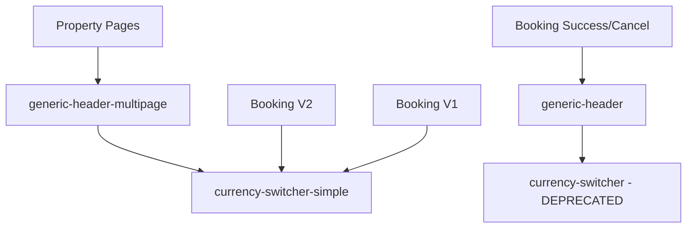

# Duplicate Components Investigation Report
**Date:** 2025-09-05  
**Status:** Complete Investigation Before Cleanup  
**Risk Level:** LOW (no active users, development environment)

## Executive Summary
The codebase contains several duplicate components that evolved during development. Since BOOKING_V2 is always `true` and there are no active users, we have an opportunity for safe cleanup. This document provides complete analysis before any changes.

## 1. Currency Switcher Components

### Components Found
1. **currency-switcher.tsx** - DEPRECATED
2. **currency-switcher-simple.tsx** - ACTIVE PRIMARY
3. **currency-switcher-safe.tsx** - DEAD CODE

### Detailed Analysis

#### currency-switcher.tsx (DEPRECATED)
- **Location:** `/src/components/currency-switcher.tsx`
- **Technology:** Uses older Select component from ui/select
- **Features:** Has emoji flags (🇺🇸 🇪🇺 🇷🇴) - violates no-emoji standard
- **Direct Imports:** 
  - ❌ NO production imports found
  - ⚠️ Imported by `generic-header.tsx:10`
- **Status:** Can be deleted after updating generic-header.tsx

#### currency-switcher-simple.tsx (ACTIVE)
- **Location:** `/src/components/currency-switcher-simple.tsx`  
- **Technology:** Modern DropdownMenu component
- **Features:** Text-based labels (USD, EUR, RON), multiple variants
- **Active Imports:**
  - `generic-header-multipage.tsx:10` - Main property pages
  - `booking-v2/containers/BookingPageV2.tsx:29` - V2 booking
  - `booking/container/BookingCheckLayout.tsx:18` - V1 booking layout
  - `currency-switcher-safe.tsx:4` - But safe is unused
- **Status:** PRIMARY - Keep this one

#### currency-switcher-safe.tsx (DEAD CODE)
- **Location:** `/src/components/currency-switcher-safe.tsx`
- **Purpose:** SSR safety wrapper for currency-switcher-simple
- **Direct Imports:** ❌ NONE - completely unused
- **Status:** DELETE - no references found

### Current Working Flow


## 2. Header Components

### Components Found
1. **generic-header.tsx** - ACTIVE (booking pages)
2. **generic-header-multipage.tsx** - ACTIVE (property pages)  
3. **client-header.tsx** - DEAD CODE

### Detailed Analysis

#### generic-header.tsx
- **Active Imports:**
  - `booking/hold-success/page.tsx:10`
  - `booking/success/page.tsx:11`
  - `booking/cancel/page.tsx:9`
  - `client-header.tsx:3` (but client-header is unused)
- **Features:** Simple header for booking result pages
- **Issue:** Uses deprecated currency-switcher.tsx
- **Status:** KEEP but update currency import

#### generic-header-multipage.tsx
- **Active Imports:**
  - `property/property-page-renderer.tsx:64` - Main property display
- **Features:** Advanced with language selector, themes, dynamic menus
- **Uses:** currency-switcher-simple (correct)
- **Status:** PRIMARY for property pages

#### client-header.tsx
- **Direct Imports:** ❌ NONE
- **Purpose:** Wrapper for translation, but unused
- **Status:** DELETE - dead code

### Current Header Usage Map
| Page Type | Header Used | Currency Component |
|-----------|------------|-------------------|
| Property Pages | generic-header-multipage | currency-switcher-simple ✅ |
| Booking Success | generic-header | currency-switcher ⚠️ |
| Booking Cancel | generic-header | currency-switcher ⚠️ |
| Booking Hold Success | generic-header | currency-switcher ⚠️ |

## 3. Booking System Analysis

### Key Finding: BOOKING_V2 is ALWAYS TRUE
```typescript
// src/config/features.ts:54
BOOKING_V2: true,  // Now the standard implementation (always enabled)
```

### V2 Usage Locations
- `/app/booking/check/[slug]/[[...path]]/page.tsx:219` - Conditionally renders V2
- `/app/booking/check/[slug]/[[...path]]/booking-client-layout.tsx:343` - V2 wrapper

### Legacy V1 Components (Can be removed)
Since BOOKING_V2 is always true, these V1 components are never reached:
- `/src/components/booking/` - Entire V1 system
- `/src/app/booking/check/[slug].old/` - Old routing structure

### Duplicate BookingForm Files
1. `/src/components/booking/forms/BookingForm.tsx` - V1
2. `/src/components/booking/sections/forms/BookingForm.tsx` - V1 duplicate
3. `/src/components/booking-v2/forms/BookingFormV2.tsx` - V2 (active)

## 4. Risk Assessment

### Safe to Delete (No Dependencies)
✅ **Immediate deletion - zero risk:**
- `/src/components/currency-switcher-safe.tsx`
- `/src/components/client-header.tsx`
- `/src/app/booking/check/[slug].old/` directory

### Requires Simple Update First
⚠️ **Update import, then delete:**
- `/src/components/currency-switcher.tsx`
  - Action: Update generic-header.tsx line 10 first
  - Change: `from '@/components/currency-switcher'` → `from '@/components/currency-switcher-simple'`

### Requires V2 Verification
🔍 **Verify V2 is working, then remove V1:**
- `/src/components/booking/` entire directory
- All conditional checks for `FEATURES.BOOKING_V2`

## 5. Cleanup Action Plan

### Phase 1: Zero-Risk Deletions (5 minutes)
```bash
# These have no imports anywhere
rm src/components/currency-switcher-safe.tsx
rm src/components/client-header.tsx  
rm -rf src/app/booking/check/[slug].old/
```

### Phase 2: Update Import & Delete (10 minutes)
1. Update `src/components/generic-header.tsx:10`
   - Change: `import { CurrencySwitcher } from '@/components/currency-switcher'`
   - To: `import { CurrencySwitcherSimple as CurrencySwitcher } from '@/components/currency-switcher-simple'`
2. Delete `src/components/currency-switcher.tsx`

### Phase 3: Remove V1 Booking (30 minutes)
1. Test V2 booking flow completely
2. Remove all `if (FEATURES.BOOKING_V2)` conditionals (always true)
3. Delete `/src/components/booking/` directory
4. Clean up imports

### Phase 4: Component Consolidation (Optional - 1 hour)
1. Merge generic-header variants into one configurable component
2. Consider if separate headers are actually needed

## 6. Testing Checklist

Before cleanup:
- [ ] Start development server
- [ ] Test property page display
- [ ] Test currency switching on property page
- [ ] Test booking flow start to finish
- [ ] Test booking success page
- [ ] Test booking cancel page

After each deletion:
- [ ] Verify build succeeds
- [ ] Test affected pages
- [ ] Check browser console for errors

## 7. Benefits of Cleanup

- **Code Reduction:** ~2,000+ lines of duplicate code
- **Clarity:** Single source of truth for each component
- **Maintenance:** No more questioning which version to update
- **Build Size:** Smaller bundle without dead code
- **Developer Experience:** Clear component hierarchy

## Recommendation

Since you're in development with no users and planning to release soon, I recommend:
1. **Do Phase 1 & 2 immediately** - Zero risk, instant cleanup
2. **Test thoroughly** - Ensure V2 booking works perfectly
3. **Do Phase 3 before release** - Ship only V2, no legacy code
4. **Consider Phase 4 post-release** - Nice to have, not critical

The key insight: **With BOOKING_V2 always true and no active users, this is the perfect time for cleanup before your release.**