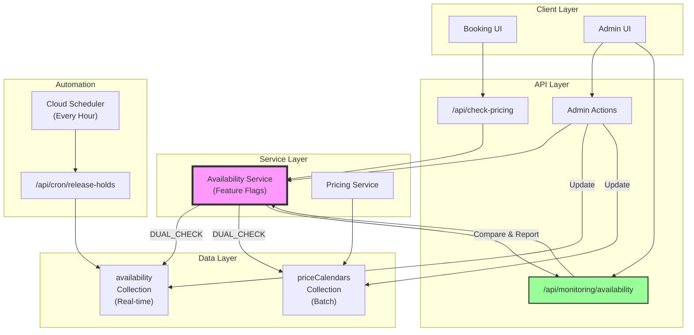

# Availability System Architecture

## Current State (DUAL_CHECK Mode)



## Feature Flag Modes

### 1. LEGACY Mode (Original)
- Uses only `priceCalendars` collection
- No awareness of `availability` collection
- Current production behavior before changes

### 2. DUAL_CHECK Mode (Current)
- Reads from both collections
- Compares results
- Reports discrepancies
- Uses `priceCalendars` for final decision (safe)

### 3. SINGLE_SOURCE Mode (Target)
- Uses only `availability` collection
- `priceCalendars` becomes pricing-only
- Cleaner architecture
- Better performance

## Data Flow

### Booking Flow:
1. User selects dates in UI
2. UI calls `/api/check-pricing`
3. API uses Availability Service
4. Service checks both collections (DUAL_CHECK)
5. Returns availability + pricing
6. Logs any discrepancies

### Admin Flow:
1. Admin toggles date availability
2. Updates both collections
3. Maintains consistency
4. Changes visible immediately

### Hold Cleanup Flow:
1. Cloud Scheduler triggers hourly
2. Finds expired holds
3. Updates booking status
4. Releases availability
5. Logs all actions

## Key Benefits

1. **Zero Downtime Migration**
   - Feature flags enable gradual rollout
   - Instant rollback capability
   - No code deployment needed for mode changes

2. **Data Integrity**
   - DUAL_CHECK catches inconsistencies
   - Monitoring provides visibility
   - Admin updates maintain sync

3. **Operational Safety**
   - Comprehensive logging
   - Real-time monitoring
   - Automated hold cleanup

## Migration Path

```
LEGACY → DUAL_CHECK → Data Cleanup → SINGLE_SOURCE
         (Week 1)      (Week 2)       (Week 3)
         ✅ DONE       IN PROGRESS    PLANNED
```