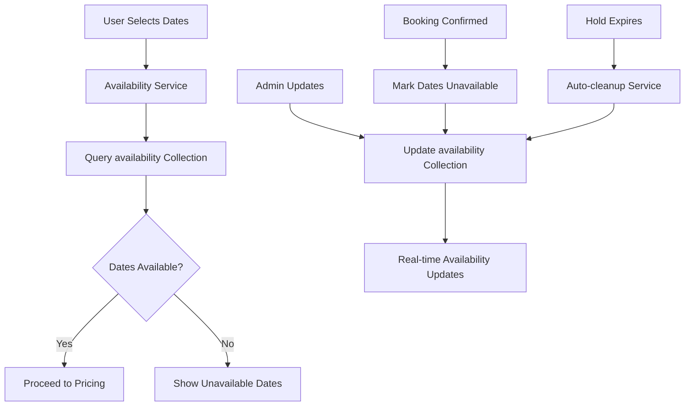

# Availability System Architecture

**Current Architecture** (Post-Migration)  
**Last Updated**: June 2025  
**Status**: Production Ready

## Overview

The availability system manages property availability data using a **single source of truth** architecture. This system was successfully migrated from a dual-storage approach to provide better consistency, performance, and maintainability.

## Architecture Principles

- **Single Source of Truth**: The `availability` collection is the authoritative source for availability data
- **Real-time Updates**: Availability changes are immediately reflected across the system
- **Separation of Concerns**: Availability data is separate from pricing data
- **Performance Optimized**: Month-based document structure for efficient queries

## Data Structure

### Availability Collection

**Collection**: `availability`  
**Document ID Pattern**: `{propertyId}_{YYYY-MM}`

```typescript
interface AvailabilityDocument {
  propertyId: string;
  year: number;
  month: number;
  available: {
    [day: number]: boolean;  // true = available, false = unavailable
  };
  holds: {
    [day: number]: {
      bookingId: string;
      holdUntil: Date;
      guestEmail: string;
    };
  };
  updatedAt: string;
}
```

**Example Document**: `prahova-mountain-chalet_2025-06`
```json
{
  "propertyId": "prahova-mountain-chalet",
  "year": 2025,
  "month": 6,
  "available": {
    "1": true,
    "2": true,
    "5": false,  // Unavailable
    "10": false, // Has hold
    "15": true
  },
  "holds": {
    "10": {
      "bookingId": "booking_123",
      "holdUntil": "2025-06-04T15:30:00Z",
      "guestEmail": "guest@example.com"
    }
  },
  "updatedAt": "2025-06-03T10:00:00Z"
}
```

## Core Service

### Availability Service (`src/lib/availability-service.ts`)

**Main Function**: `checkAvailabilityWithFlags(propertyId, checkInDate, checkOutDate)`

```typescript
interface AvailabilityResult {
  isAvailable: boolean;
  unavailableDates: string[];
  source: 'availability';
}
```

**Key Features**:
- Month-based document queries for efficiency
- Handles date ranges spanning multiple months
- Checks both explicit unavailability and active holds
- Returns detailed unavailable date information

**Algorithm**:
1. Group requested dates by month (YYYY-MM)
2. Query availability documents for each month
3. For each date, check:
   - `available[day] === false` (explicitly unavailable)
   - `holds[day]` exists (has active hold)
4. Return aggregated results

## Integration Points

### 1. Booking System

**Location**: `src/components/booking/`

The booking system uses the availability service to:
- Pre-load unavailable dates for calendar display
- Validate date selections before pricing
- Show real-time availability feedback

```typescript
// In booking components
const availabilityResult = await checkAvailabilityWithFlags(
  propertyId, 
  checkInDate, 
  checkOutDate
);
```

### 2. Admin Interface

**Location**: `src/app/admin/pricing/server-actions-hybrid.ts`

Admin updates modify availability through the `updateDay` function:
- Updates availability collection when dates are marked available/unavailable
- Maintains data consistency during admin operations
- Provides immediate feedback to availability queries

### 3. API Endpoints

**Primary Endpoints**:
- `/api/check-pricing` - Uses availability service for date validation
- `/api/check-availability` - Direct availability checking for calendar display
- `/api/monitoring/availability` - Health checks and system monitoring

## Data Flow



## Performance Characteristics

### Query Patterns
- **Single Month**: O(1) document lookup
- **Multi-Month Range**: O(n) where n = number of months
- **Typical Response Time**: < 100ms for 12-month ranges

### Storage Efficiency
- **Document Size**: ~2-5KB per month per property
- **Index Usage**: Firestore auto-indexes on document ID
- **Scalability**: Linear scaling with properties × months

## Monitoring & Health

### Health Check Endpoint
`GET /api/monitoring/availability`

**Metrics Tracked**:
- Availability collection accessibility
- Query response times
- Hold cleanup effectiveness

**Expected Response**:
```json
{
  "timestamp": "2025-06-03T10:00:00Z",
  "systemHealth": {
    "status": "healthy",
    "availabilityCollectionAccessible": true,
    "holdCleanupRunning": true
  },
  "performanceMetrics": {
    "lastCheckDuration": 85
  }
}
```

## Error Handling

### Missing Documents
- **Behavior**: Treat all dates as unavailable
- **Logging**: Warning logged for missing documents
- **Recovery**: Documents auto-created on first admin update

### Service Failures
- **Fallback**: Return conservative unavailable response
- **Logging**: Error details logged for debugging
- **Monitoring**: Health check detects service issues

## Hold Management

### Automatic Cleanup
- **Service**: Cron job at `/api/cron/release-holds`
- **Schedule**: Every 15 minutes
- **Action**: Removes expired holds from availability documents

### Hold Creation
```typescript
// Creating a hold
await setDoc(availabilityRef, {
  [`holds.${day}`]: {
    bookingId: 'booking_123',
    holdUntil: new Date(Date.now() + 15 * 60 * 1000), // 15 minutes
    guestEmail: 'guest@example.com'
  }
}, { merge: true });
```

## Migration Notes

This system replaced a dual-storage approach where availability was stored in both `availability` and `priceCalendars` collections. The migration was completed in June 2025 with:

- ✅ Zero downtime migration
- ✅ Data consistency verified
- ✅ Performance improvements achieved
- ✅ Legacy code completely removed

## Best Practices

### For Developers
1. **Always use the availability service** - Never query availability collection directly
2. **Handle missing documents gracefully** - Assume unavailable when documents don't exist
3. **Log availability decisions** - Include source and reasoning in logs
4. **Test date edge cases** - Month boundaries, leap years, timezone handling

### For Operations
1. **Monitor hold cleanup** - Ensure cron job is running regularly
2. **Watch query performance** - Alert on response times > 500ms
3. **Backup availability data** - Regular exports for disaster recovery
4. **Index optimization** - Monitor Firestore index usage

## Future Considerations

### Potential Enhancements
- **Caching Layer**: Redis cache for frequently accessed months
- **Batch Operations**: Bulk availability updates for large date ranges
- **Advanced Hold Logic**: Priority holds, extended hold periods
- **Analytics Integration**: Availability trends and insights

### Scalability Limits
- **Current Capacity**: 1000+ properties × 24 months = ~24K documents
- **Query Limits**: Firestore batch size limits (500 documents)
- **Storage Limits**: Effectively unlimited for this use case

---

**Related Documentation**:
- [Booking System Architecture](./multipage-architecture.md)
- [Admin Interface Guide](../guides/extending-admin-interface.md)
- [API Documentation](../guides/api-only-pricing.md)