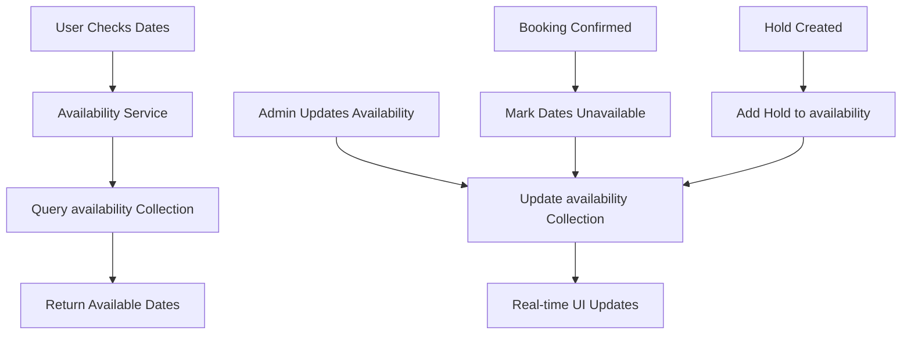
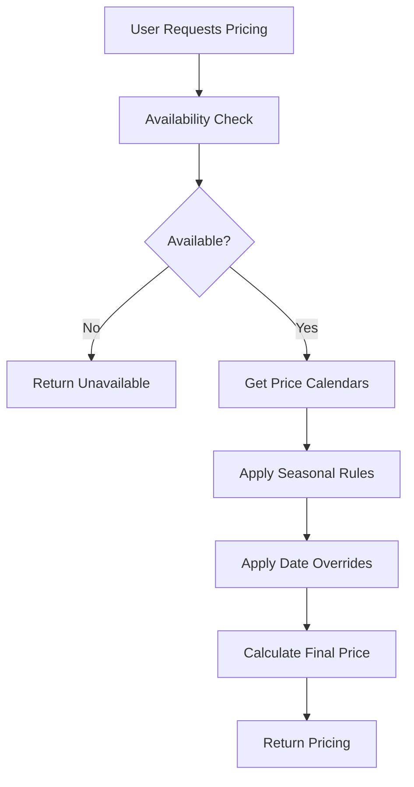
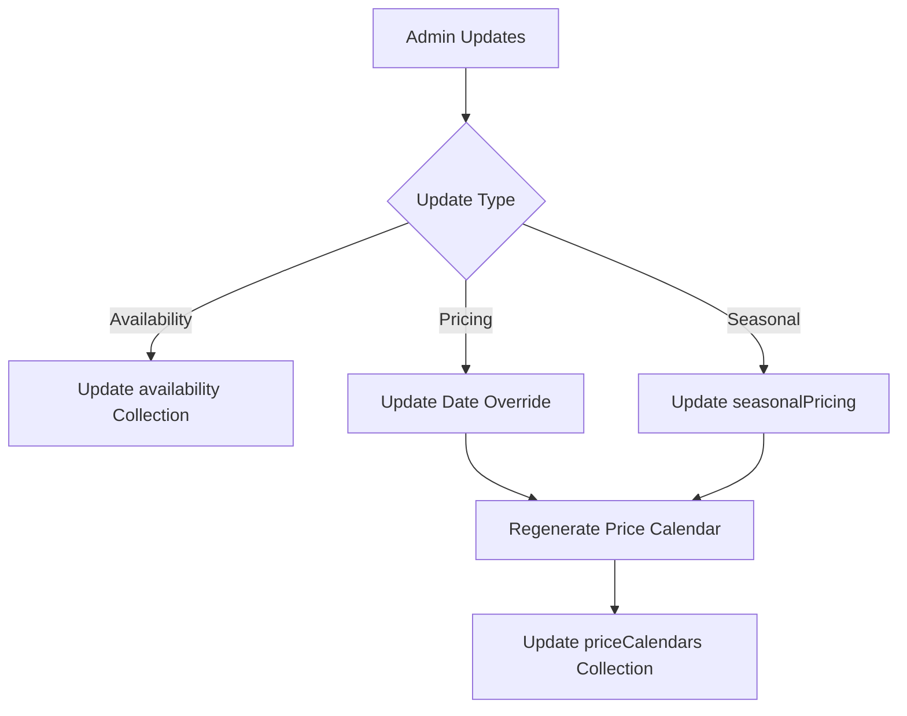

# Data Architecture Overview

**System**: RentalSpot Property Management Platform  
**Last Updated**: June 2025  
**Status**: Production Ready

## Overview

The RentalSpot platform uses a clean separation of concerns architecture with distinct data collections for different business domains. This document outlines the current data architecture after the successful availability deduplication migration.

## Core Data Collections

### 1. Properties Collection
**Purpose**: Master property data and configuration  
**Collection**: `properties`

```typescript
interface Property {
  id: string;                    // Property slug (URL-friendly)
  name: string;                  // Display name
  location: string;              // Location description
  pricePerNight: number;         // Base price
  baseCurrency: 'EUR' | 'USD';   // Currency
  baseOccupancy: number;         // Base guest count
  maxGuests: number;             // Maximum guests
  extraGuestFee: number;         // Per-night extra guest fee
  cleaningFee: number;           // One-time cleaning fee
  status: 'active' | 'inactive'; // Property status
  pricing: {
    pricingTemplateId: string;
    useDynamicPricing: boolean;
    occupancyPricing: OccupancyConfig;
    lengthOfStayDiscounts: DiscountRule[];
    weekendPricing: WeekendConfig;
  };
}
```

### 2. Availability Collection ⭐ **Single Source of Truth**
**Purpose**: Real-time availability tracking  
**Collection**: `availability`  
**Document Pattern**: `{propertyId}_{YYYY-MM}`

```typescript
interface AvailabilityDocument {
  propertyId: string;
  year: number;
  month: number;
  available: {
    [day: number]: boolean;      // true = available, false = booked/blocked
  };
  holds: {
    [day: number]: {
      bookingId: string;
      holdUntil: Date;
      guestEmail: string;
    };
  };
  updatedAt: string;
}
```

### 3. Price Calendars Collection
**Purpose**: Pricing data and rate management  
**Collection**: `priceCalendars`  
**Document Pattern**: `{propertyId}_{YYYY-MM}`

```typescript
interface PriceCalendar {
  propertyId: string;
  year: number;
  month: number;
  days: {
    [day: string]: {
      basePrice: number;
      adjustedPrice: number;
      prices: {                  // Multi-occupancy pricing
        [guestCount: string]: number;
      };
      minimumStay: number;
      priceSource: 'base' | 'season' | 'override' | 'weekend';
      seasonId?: string;
      overrideId?: string;
      reason?: string;
    };
  };
  summary: PriceCalendarSummary;
  generatedAt: string;
}
```

### 4. Seasonal Pricing Collection
**Purpose**: Seasonal rate rules  
**Collection**: `seasonalPricing`

```typescript
interface SeasonalPricing {
  id: string;
  propertyId: string;
  name: string;                  // e.g., "Summer 2025"
  startDate: Date;
  endDate: Date;
  priceMultiplier: number;       // e.g., 1.5 for 50% increase
  minimumStay: number;
  enabled: boolean;
}
```

### 5. Date Overrides Collection
**Purpose**: Specific date pricing and availability overrides  
**Collection**: `dateOverrides`

```typescript
interface DateOverride {
  id: string;
  propertyId: string;
  date: string;                  // YYYY-MM-DD format
  customPrice?: number;
  available: boolean;
  minimumStay?: number;
  reason?: string;               // e.g., "Maintenance", "Holiday Premium"
}
```

### 6. Bookings Collection
**Purpose**: Booking records and hold management  
**Collection**: `bookings`

```typescript
interface Booking {
  id: string;
  propertyId: string;
  checkInDate: Date;
  checkOutDate: Date;
  status: 'confirmed' | 'on-hold' | 'cancelled';
  holdUntil?: Date;              // For temporary holds
  guestInfo: GuestInformation;
  pricing: BookingPricing;
  paymentStatus: PaymentStatus;
}
```

## Data Flow Architecture

### 1. Availability Flow


### 2. Pricing Flow


### 3. Admin Management Flow


## Key Design Decisions

### ✅ Separation of Concerns
- **Availability**: Real-time, frequently updated
- **Pricing**: Calculated, cached for performance
- **Configuration**: Stable, infrequently changed

### ✅ Month-Based Partitioning
- **Benefits**: Efficient queries, manageable document sizes
- **Trade-off**: Multi-month queries require multiple documents
- **Optimization**: Batch queries for date ranges

### ✅ Real-time Availability
- **Source of Truth**: `availability` collection only
- **Updates**: Immediate reflection in UI
- **Consistency**: No dual-storage conflicts

### ✅ Hold Management
- **Temporary Reservations**: Built into availability system
- **Auto-cleanup**: Cron job removes expired holds
- **Race Condition Prevention**: Atomic Firestore operations

## Performance Characteristics

### Query Patterns
| Operation | Complexity | Typical Response |
|-----------|------------|------------------|
| Single month availability | O(1) | < 50ms |
| 12-month availability | O(12) | < 200ms |
| Price calculation | O(days) | < 100ms |
| Admin updates | O(1) | < 150ms |

### Storage Efficiency
| Collection | Document Size | Growth Rate |
|------------|---------------|-------------|
| availability | 2-5KB | Linear with properties |
| priceCalendars | 5-15KB | Linear with properties |
| properties | 3-8KB | Linear with properties |
| seasonalPricing | 1KB | Slow growth |
| dateOverrides | 0.5KB | Moderate growth |

## Data Consistency Guarantees

### Strong Consistency
- **Availability Updates**: Immediate consistency within collection
- **Admin Operations**: Transactional updates across related collections
- **Hold Operations**: Atomic read-modify-write operations

### Eventual Consistency
- **Price Calendar Regeneration**: May take 1-2 seconds after rule changes
- **Cross-collection Updates**: Admin UI may show temporary inconsistency
- **Cache Invalidation**: Client-side caches updated within 30 seconds

## Backup & Recovery

### Daily Backups
- **Automated**: Firestore export to Cloud Storage
- **Retention**: 30 days for availability, 90 days for configuration
- **Recovery Time**: < 4 hours for full restore

### Point-in-Time Recovery
- **Granularity**: 1-minute resolution for last 7 days
- **Scope**: Individual collections or full database
- **Testing**: Monthly recovery tests performed

## Monitoring & Alerts

### Health Metrics
- **Availability Collection**: Accessibility and response times
- **Hold Cleanup**: Automated cleanup success rate
- **Data Consistency**: Cross-collection validation checks
- **Query Performance**: 95th percentile response times

### Alert Conditions
- **Availability Queries**: > 500ms response time
- **Missing Documents**: > 5% unavailable dates
- **Hold Cleanup Failures**: > 2 consecutive failures
- **Storage Growth**: > 20% month-over-month increase

## Security & Access Control

### Collection-Level Security
```javascript
// Firestore Security Rules
rules_version = '2';
service cloud.firestore {
  match /databases/{database}/documents {
    // Public read for availability (cached/optimized)
    match /availability/{document} {
      allow read: if true;
      allow write: if request.auth != null && 
                      request.auth.token.admin == true;
    }
    
    // Admin-only access for sensitive collections
    match /bookings/{document} {
      allow read, write: if request.auth != null && 
                           request.auth.token.admin == true;
    }
  }
}
```

### API Security
- **Authentication**: Firebase Admin SDK for server operations
- **Authorization**: Admin token validation for write operations
- **Rate Limiting**: Per-IP limits on public endpoints
- **Input Validation**: Schema validation on all inputs

## Migration History

### June 2025: Availability Deduplication
- **Goal**: Eliminate dual-storage inconsistencies
- **Process**: Gradual migration with feature flags
- **Result**: 100% single-source architecture
- **Benefits**: Better consistency, simplified maintenance

### Previous Migrations
- **May 2025**: Multi-language support added
- **April 2025**: V2 booking system implementation
- **March 2025**: Admin interface overhaul

---

**Related Documentation**:
- [Availability System Architecture](./availability-system.md)
- [Booking System V2 Specification](../implementation/booking-system-v2-specification.md)
- [Admin Interface Guide](../guides/extending-admin-interface.md)